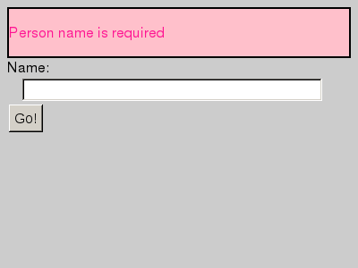

# Testing with CasperJS

[CasperJS][casperjs] is a library that makes it easier to
manipulate the headless WebKit browser and API provided by
[PhantomJS][phantomjs]. It's similar to other
[web automation libraries][wwwmech] in terms of making easy
things easy. But it adds useful twists by both enabling
automation in JavaScript, and actually automating an instance of
a web browser vs simple consuming HTML and communicating over
HTTP. This post will briefly introduce how you can use Casper to
test your dynamic application.

One note: I won't talk at all about installation. There's no
reason to copy the
[excellent documentation from Casper][casperinstall] which tells
you how to install PhantomJS as well.

## Quick example

This article has a couple of examples; both are on
[github][samplerepo] and can be used without a webserver.

Before giving an overview of Casper, let's go through just about
the simplest example possible. A form validates that a person's
name has a value when the user submits a form; that validation
happens client-side. Our test opens the page, submits the form,
and checks for the message, also capturing a screenshot (see
`test/validation_simple.js`):

    var casper = require( 'casper' ).create();
    
    casper.start( 'web/simple_form.html', function() {
        this.click( '#simple_form_submit' );
        var errorText = this.fetchText( '#errors' );
        this.capture( 'simple_1_with_error.png' );
        this.test.assertMatch( errorText,  /Person name is required/, 
                               'Expected validation message for person name' );
    });
    
    casper.run( function() {
        this.test.renderResults( true );
    });

And running it we get the following, with nice green ANSI blocks
if you're using a proper terminal:

    $ casperjs test/validation_simple.js 
    PASS Expected validation message for person name
    PASS 1 tests executed, 1 passed, 0 failed.

Our captured screenshot might look like:

## The unique snowflake of Casper

What's unique about this testing?

1. You get to write in JavaScript! We'll talk more about this
below, but I think it's a boon to write in the language of the
environment you're testing (the browser) rather than in your
server-side language (Ruby, Java, C#, PHP, etc).

2. You're automating a real browser, but with neither the
deployment hassles of a windowing environment nor the limited
utility of a 'fake' environment like [Env.js][envjs] or
[HtmlUnit][htmlunit].

3. You can programmatically manipulate the browser, so doing
things like capturing screenshots is trivial, as is doing things
like capturing logging messages from the __browser__ alongside
your testing logging messages.

For example, you may notice that the screenshot is very small
(400x300), which is Phantom's default. But you can easily
manipulate it by just adding a line telling Casper to use a new
viewport (example in `test/validation_simple_dimensions.js`):

    casper.start( 'web/simple_form.html', function() {
        casper.viewport( 1280, 800 );

The remainder of this will walk through a more complex
example. It's also a form submission. But it has:

* sections that are conditionally displayed,
* form elements dynamically generated from JSON fetched via AJAX,
* validation on submit

To test it out, just open the file `web/complex_form.html` in a
browser. (One note -- if you're using Chrome you need to start it
with the flag `--allow-file-access-from-files`, oherwise the AJAX
calls won't be able to load the static JSON files -- see
[#40787][chromefile].)

## Turtles most of the way down

The 

## Real browser!

## More complex example

### Moving data from browser to test: easy

- Give example of JS in browser that we can use and query
  directly
- NB: cannot return references to 'live' browser resources (e.g.,
  nodes in the DOM, 'window', 'document', etc.) [test out Date?]

### Easy to forget the sandbox

- Easy to forget that you cannot create a simple JS closure to
  execute in the browser; references to your test scope objects
  will be lost
- Casper provides a clever (if hacky) way of doing so; a version
  tied to Phantom 1.6 will be able to execute code directly (!!)

## Useful types of testing

- Don't duplicate testing elsewhere. For example, modern web
  applications have pretty robust means of testing many layers of
  your application without using a browser at all. Don't
  duplicate them, concentrate on functionality that's in the
  browser only.

- Don't use this to test non-web libraries; use something like
  jsprove, whatever

## vs Selenium

+ headless operation
+ easy setup
+ single environment (see above)

- only webkit
- relatively immature and unsupported

[casperinstall]: http://casperjs.org/installation.html
[casperjs]: http://casperjs.org/
[chromefile]: http://code.google.com/p/chromium/issues/detail?id=40787
[envjs]: http://www.envjs.com/
[htmlunit]: http://htmlunit.sourceforge.net/
[phantomjs]: http://phantomjs.org/
[samplerepo]: https://github.com/cwinters/summa_blog/tree/master/201204-casper_intro
[wwwmech]: http://search.cpan.org/search?query=www%3A%3Amechanize&mode=dist
